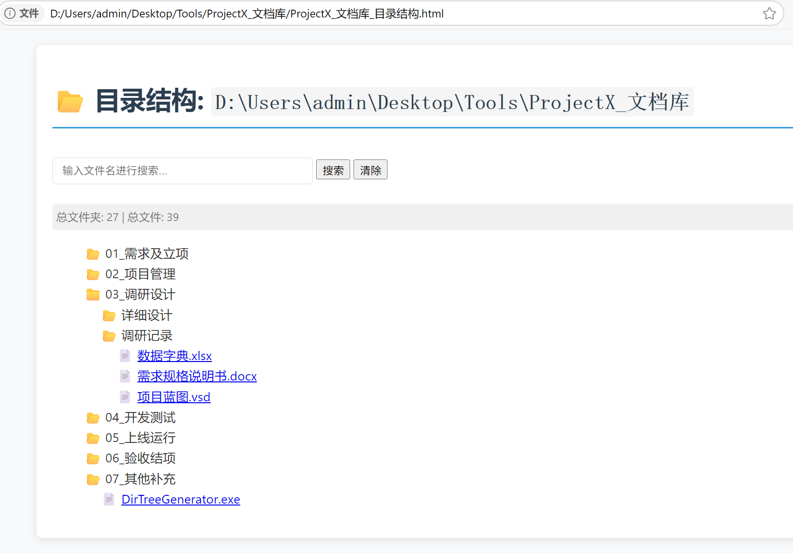

这是一个基于python编写的适用于Windows系统下文件夹及文件目录生成工具。

# 使用方式
## 1、直接下载运行
（1）本地安装python 3.6+；

（2）下载generate_dir_tree.py；

（3）将generate_dir_tree.py放置到要生成目录树的文件夹下；

（4）打开cmd切换到目标文件夹目录，运行python generate_dir_tree.py，会在该文件夹下生成一个文件夹目录树的html文件。
## 2、下载编译好的exe程序
在release中的DirTreeGenerator.exe程序，将程序放置到目标文件夹下，双击程序运行，会在该文件夹下生成一个文件夹目录树的html文件。

## 3、自主编译
下载现在所有code到本地，
安装pip install pyinstaller，
再运行python to exe.bat，可以自主打包成exe程序。
在python to exe.bat中可以修改程序名称、图标ICO等。
